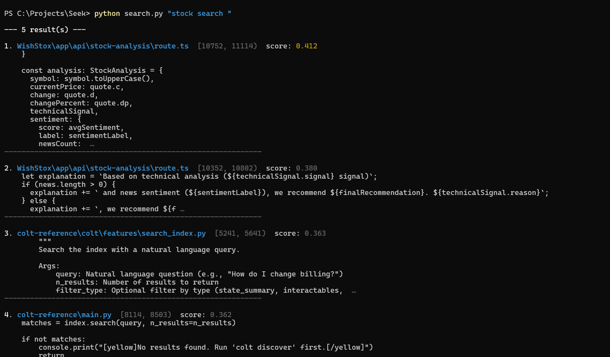

# Seek

Terminal-based semantic code search across all your local repos.
CocoIndex handles incremental re-indexing automatically on every file save — no cron jobs.

Everything runs locally: no API keys, no cloud services, no cost.



---

## How it works

1. **Watch** — CocoIndex monitors `SEEK_PROJECTS_PATH` for changes to source files
2. **Chunk** — changed files are split into overlapping 500-char chunks
3. **Embed** — each chunk is embedded with `all-MiniLM-L6-v2` (runs on CPU, no GPU needed)
4. **Store** — embeddings land in PostgreSQL with pgvector
5. **Search** — your query is embedded with the same model, then nearest-neighbour search returns the top results

---

## Setup

### 1. Install PostgreSQL + pgvector

Download PostgreSQL from <https://www.postgresql.org/download/>

After install, create the database and enable the extension:

```sql
CREATE DATABASE seek;
\c seek
CREATE EXTENSION vector;
```

### 2. Install Python dependencies

```bash
pip install -r requirements.txt
```

### 3. Configure the environment

```bash
cp .env.example .env
# Open .env and fill in your Postgres password
```

The only required variable is `COCOINDEX_DATABASE_URL`.

### 4. Index

```bash
cocoindex update index.py
```

This creates the schema and indexes everything under `SEEK_PROJECTS_PATH` (default `C:/Projects`).

### 5. Live watch mode

```bash
cocoindex update index.py -L
```

Keep this running in a terminal. Seek re-indexes any changed file within a few seconds of saving.

### 6. Search

```bash
# Interactive REPL
python search.py

# One-shot
python search.py "function that reads a file"
```

---

## Search options

```
python search.py [query] [options]

positional:
  query                 natural-language search (omit for interactive mode)

options:
  -k N, --top-k N       number of results to show (default: 5)
  --ext py,go,ts        filter by file extension(s), comma-separated
  --path SUBSTR         only show results whose path contains SUBSTR
  --json                print results as JSON (pipe-friendly)
```

### Examples

```bash
python search.py "authentication middleware" --top-k 10
python search.py "database connection pool" --ext py,go
python search.py "error handling" --path myrepo/
python search.py "jwt decode" --json | jq '.[].filename'
```

---

## Configuration

All settings are read from `.env`. Defaults are shown in `.env.example`.

| Variable | Default | Description |
|---|---|---|
| `COCOINDEX_DATABASE_URL` | *(required)* | PostgreSQL connection string |
| `SEEK_PROJECTS_PATH` | `C:/Projects` | Root directory to index |
| `SEEK_EMBED_MODEL` | `sentence-transformers/all-MiniLM-L6-v2` | Embedding model |
| `SEEK_CHUNK_SIZE` | `500` | Chunk size in characters |
| `SEEK_CHUNK_OVERLAP` | `100` | Overlap between chunks |
| `SEEK_TOP_K` | `5` | Default number of search results |

> If you change `SEEK_EMBED_MODEL` after indexing, drop the `seekindex__code_embeddings` table and re-run `cocoindex update index.py` to re-embed with the new model.

---

## Running tests

```bash
pytest tests/ -v
```

---

## File structure

```
Seek/
├── index.py          # CocoIndex flow — chunking, embedding, storage
├── search.py         # CLI search tool
├── config.py         # Settings (reads from .env)
├── requirements.txt  # Python dependencies
├── .env.example      # Config template
└── tests/
    └── test_search.py
```

---

## Troubleshooting

**`COCOINDEX_DATABASE_URL is not set`**
Copy `.env.example` to `.env` and fill in your Postgres password.

**`Could not connect to database`**
Make sure PostgreSQL is running.

**No results after indexing**
Check that `SEEK_PROJECTS_PATH` points to where your code lives.

**Slow first search**
The sentence-transformers model is downloaded on first run (~90 MB). Subsequent runs load from cache.
